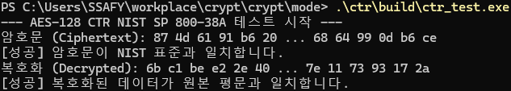

# CTR (Counter) Mode

## Description
카운터 값을 암호화하여 키 스트림을 생성하며, 각 블록을 독립적으로 처리할 수 있습니다.

### Encryption / Decryption

## Test

## Reference
- Document: [NIST SP 800-38A](https://nvlpubs.nist.gov/nistpubs/legacy/sp/nistspecialpublication800-38a.pdf)
- Section: 6.5 Counter Mode (Page 13)